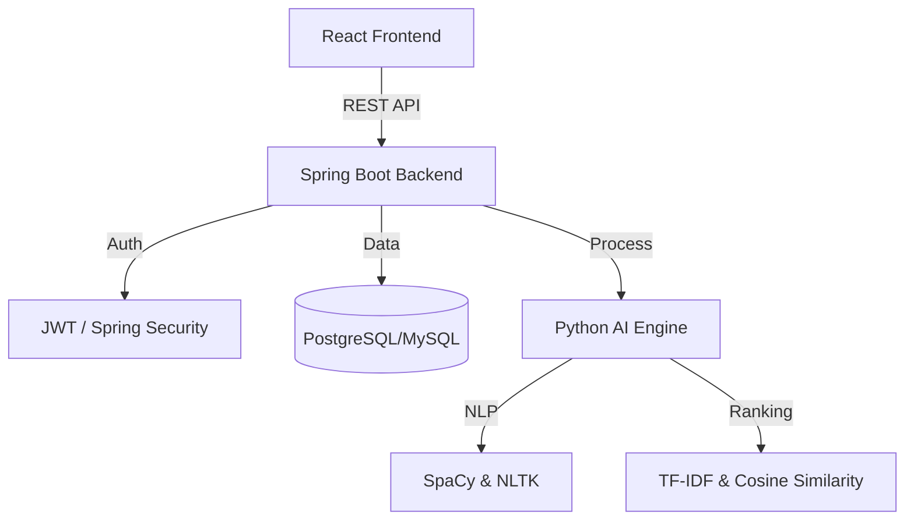
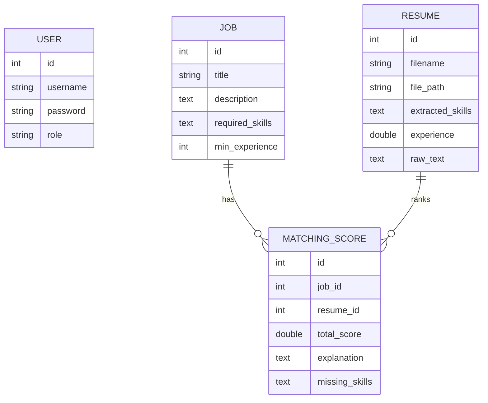
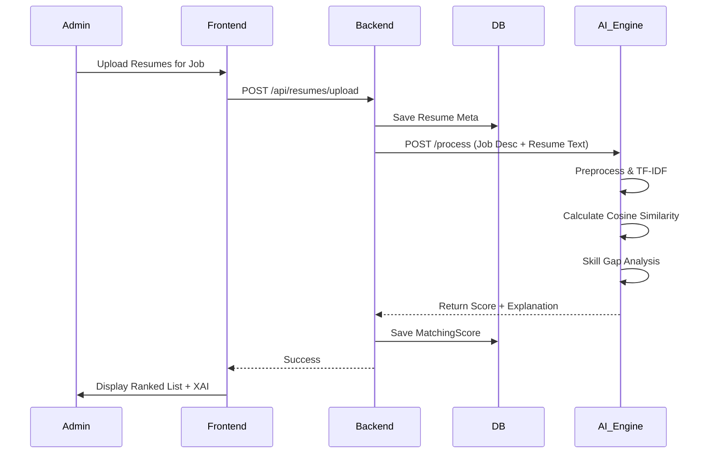
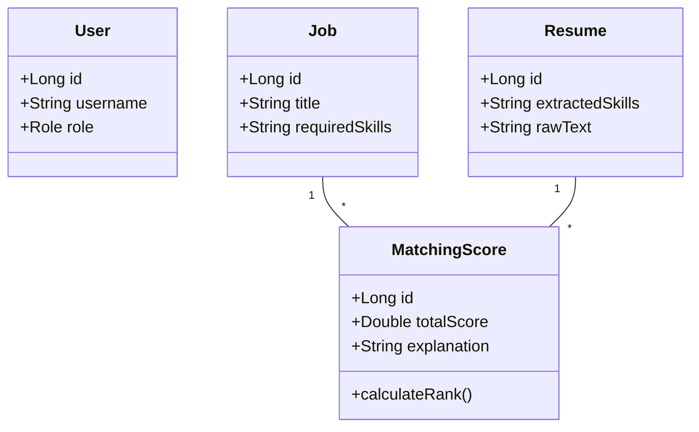

# System Architecture & Documentation

## 1. System Architecture Diagram


## 2. ER Diagram


## 3. Case Diagram
```mermaid
usecaseDiagram
    actor Admin
    actor Candidate
    
    Admin --> (Create Job)
    Admin --> (Upload Resumes)
    Admin --> (View Rankings)
    Admin --> (Analyze Skill Gaps)
    Admin --> (View Analytics)
    
    Candidate --> (Upload Resume)
    Candidate --> (Get Feedback)
```

## 4. Sequence Diagram (Resume Ranking Flow)


## 5. Class Diagram (Backend Core)

